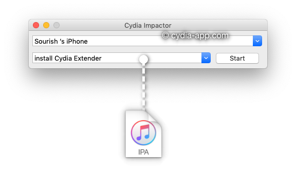

# What is sideloading?

When referring to iOS devices,  "sideloading" means installing an app in IPA format onto an Apple Device, usually through the use of a computer program such as [Cydia Impactor](http://www.cydiaimpactor.com/), Xcode, on the actual device using a Jailbreak method or using a **signing service** instead of Apple's App Store. On modern versions of iOS, the sources of the apps must be trusted by both Apple and the user under "profiles and device management" in settings; except when using jailbreak methods of sideloading apps.

## Advantages

Sideloading has several advantages when compared with other ways of delivering content to mobile devices:

* There are no restrictions on what content can be sideloaded. Users may sideload any compatible App which may be restricted or banned in their country.
* Content that is removed from the App Store, e.g., for belatedly discovered licensing violations, can still be loaded to the Apple device, as long as there is a decrypted archive of the app. 
* **Tweaked** apps, commonly applied in Jailbroken devices can be applied, and loaded onto a **non-jailbroken** device.\* 

_\* Depending on tweak requirements_ 

## Disadvantages

* Depends on the method of sideloading chosen

#### References

1. Sideloading \([https://en.wikipedia.org/wiki/Sideloading](https://en.wikipedia.org/wiki/Sideloading)\) 

